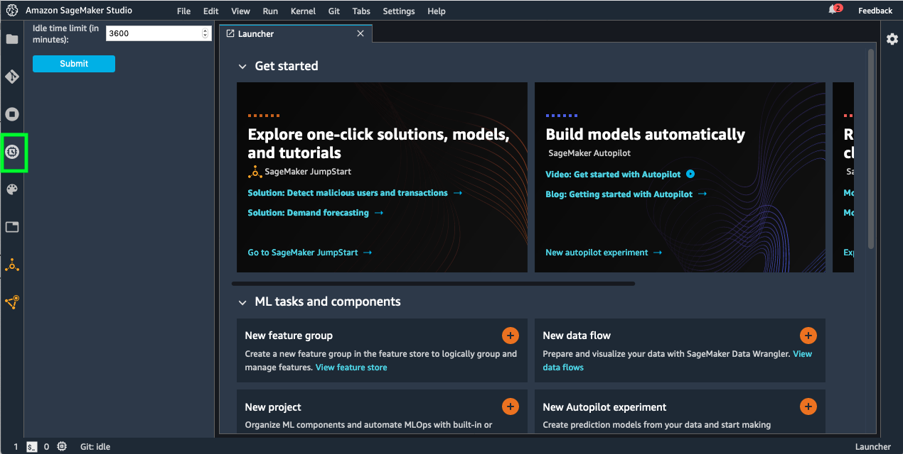

# Sagemaker-Studio-Autoshutdown-Extension

This JupyterLab extension automatically shuts down Kernels and Apps in Sagemaker Studio when they are idle for a stipulated period of time. You will be able to configure an idle time limit using the user interface this extension provides. Installation instructions are listed below.


This extension is composed of a Python package named `sagemaker_studio_autoshutdown`
for the server extension and a NPM package named `sagemaker-studio-autoshutdown`
for the frontend extension.

## Requirements

* Please ensure your JupyterLab version is >= v1.2.18 and < 2.0. You can check the version by opening a terminal window in SageMaker Studio (File > New -> Terminal) and running the following command: 'jupyter lab --version'

## Installation Steps

There are two options, outlined below, for installing this extension. We also provide a way for mointoring user profiles to ensure extension is installed.

### Option #1: Automatic Installation on JupyterLab start-up

Use this option if you have **IAM authentication (*not* SSO)** for all users in your SageMaker Studio domain. This option will be ideal if you are administering large number of users. Follow the [README](auto-installer/README.md) in the auto-installer folder.

### Option #2: Manual Installation

Use this option if you have fewer users and can administer manually.

1. Open a Terminal session in your Sagemaker Studio's Jupyter Server. (You can do this by clicking File > New > Terminal)

2. Download/Clone the current repository by running: 
```bash
git clone https://github.com/aws-samples/sagemaker-studio-auto-shutdown-extension.git
```
3. Change directory to sagemaker-studio-auto-shutdown-extension:
```bash
cd sagemaker-studio-auto-shutdown-extension
```
4. Run the following script. This step will take about 3 minutes.

```bash
./install_tarball.sh
```
5. Refresh your IDE to see the extension on the sidebar as shown in the screen shot below:



### Monitoring the installation across all users

You can periodically monitor to check if the extension is installed and running across all users, and get notified if it is not. Checkout the folder [extension-checker](extension-checker) for more information. This feature is only supported in IAM mode, and is not supported in SSO mode.


## Idle Time Limit Setting

*Idle time limit (in minutes)* - This parameter is to set an idle time after which the idle kernels and Apps with no active notebook sessions will be terminated. By default the idle time limit is set to 120 mins. Idle state is decided based on JupyterServer’s implementation of execution_state and last_activity metadata of the kernels. Read this for more information - When is a kernel considered idle? (https://github.com/jupyter/notebook/issues/4634)

## Limitations

1. This extension does not take open terminals into consideration. For example, if your kernels are idle for the time you configured but the terminals are not then the extension will shut down the terminals and the kernels.
2. You will need to reinstall this extension and configure the idle time limit, each time you delete your user's JupyterServer "app" and recreate it. See the [auto-installer](auto-installer) for an example of how to centrally automate installation. 

## Troubleshooting

#1 Delete JupyterServer and recreate it. You can do this by selecting the User and going into User Details screen in SageMaker Studio console. It is a two step process: 1/ delete JupyterServer app. 2/ Click on "Open Studio", which will recreate JupterServer with the latest version.

#2 If you are seeing the frontend extension but it is not working, check
that the server extension is enabled:

```bash
jupyter serverextension list
```

#3 If the server extension is installed and enabled but you are not seeing
the frontend, check the frontend is installed:

```bash
jupyter labextension list
```

If it is not installed, try:

```bash
bash install_server_extension.sh
bash install_frontend_extension.sh
```

### Uninstall

```bash
pip uninstall sagemaker_studio_autoshutdown
jupyter labextension uninstall sagemaker-studio-autoshutdown
```

## Security

See [CONTRIBUTING](CONTRIBUTING.md#security-issue-notifications) for more information.

## License

This project is licensed under the Apache-2.0 License.
