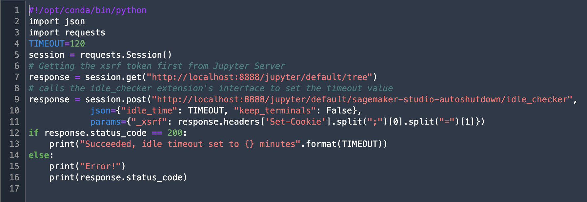
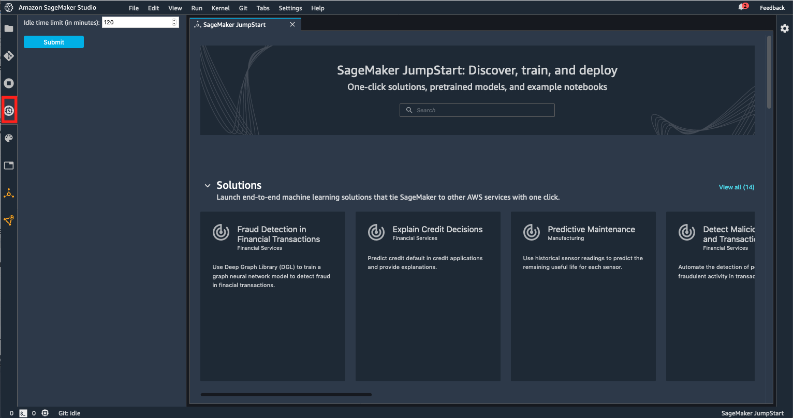

# Sagemaker-Studio-Autoshutdown-Extension

This JupyterLab extension automatically shuts down Kernels, Terminals and Apps in Sagemaker Studio when they are idle for a stipulated period of time. You will be able to configure an idle time limit using the user interface this extension provides. Installation instructions are listed below.


This extension is composed of a Python package named `sagemaker_studio_autoshutdown`
for the server extension and a NPM package named `sagemaker-studio-autoshutdown`
for the frontend extension.

## Requirements

* Please ensure your JupyterLab version is >= v1.2.18 and < 2.0. You can check the version by opening a terminal window in SageMaker Studio (File > New -> Terminal) and running the following command: 'jupyter lab --version'

## Limitations

The extension currently checks Kernels only and cannot detect idle terminals. Those Apps which has no kernels but has active image terminals will not be terminated.

# SageMaker Studio Autoshutdown Installation

There are **two options** that you can use to install the Studio Autoshutdown Extension. The **first option** does not contain an interface rather it allows you to dictate shutdown through a **Studio Terminal or Lifecycle Configuration (LCC- https://docs.aws.amazon.com/sagemaker/latest/dg/studio-lcc.html)**. The **second option** provides a **UI** in which you can manage the Timeout Limit visually.  

Below are installation instructions for setup for both options.

## Option 1: Server Extension
This option installs a server side extension. Installing does not require Internet connection (as all the dependencies are stored in the install tarball) and can be done via VPCOnly mode. For testing purpose, you can run the script from a JS terminal. Note - this option does not have the UI to set idle timeout limit but can be automated through a LCC script.

1. Open a Terminal session in your Sagemaker Studio's Jupyter Server. (You can do this by clicking File > New > Terminal)
2. Include the following script to JupyterServer (JS) LCC - https://github.com/aws-samples/sagemaker-studio-lifecycle-config-examples/tree/main/scripts/install-autoshutdown-server-extension or run from JS terminal if you are testing.

After running the script you should see a script such as the following created. Within this script you can **adjust** the **Timeout Limit** for the amount you desire.



After running this script you should see a **successful installation message** through the SageMaker terminal. (Run using **python set-time-interval.sh**).


## Option 2: Jupyter Lab UI Shutdown Installation
Use this option if you have fewer users and can administer manually. Creates a **UI** Jupyter Lab Widget which you can use to configure the Timeout Limit. This option requires Internet access as the dependencies have to be pulled down.

1. Open a Terminal session in your Sagemaker Studio's Jupyter Server. (You can do this by clicking File > New > Terminal)

2. Download/Clone the current repository by running: 
```bash
git clone https://github.com/aws-samples/sagemaker-studio-auto-shutdown-extension.git
```
3. Change directory to sagemaker-studio-auto-shutdown-extension:
```bash
cd sagemaker-studio-auto-shutdown-extension
```
4. Run the following script. This step will take about 3 minutes.

```bash
./install_tarball.sh
```
5. Refresh your IDE to see the extension on the sidebar as shown in the screen shot below:



### Monitoring the installation across all users

You can periodically monitor to check if the extension is installed and running across all users, and get notified if it is not. Checkout the folder [extension-checker](extension-checker) for more information. This feature is only supported in IAM mode, and is not supported in SSO mode.


## Idle Time Limit Setting

*Idle time limit (in minutes)* - This parameter is to set an idle time after which the idle kernels and Apps with no active notebook sessions will be terminated. By default the idle time limit is set to 120 mins. Idle state is decided based on JupyterServer’s implementation of execution_state and last_activity metadata of the kernels. Read this for more information - When is a kernel considered idle? (https://github.com/jupyter/notebook/issues/4634)

## Shutting down image terminals

By turning off the "Keep terminals" checkbox on the configuration panel, the extension will terminate all Image Terminals which belongs to applications not having any running kernel session. In this case, the application will be shut down as well. If the "Keep terminals" checkbox is enabled and there is an image terminal is running, the App never will be terminated, even when it has no running kernel session at all.

## Handling Apps without kernel and terminal sessions

Studio users have an option to terminate kernels and terminals under an App, but leave the App itself up and running. This can be used to reuse the existing Application later, hence keep the Kernel start-up time low. If the extension is installed, the extension will terminate these "empty" applications after the idle time set, but no earlier than 5 minutes.

## Limitations

1. You will need to reinstall this extension and configure the idle time limit, each time you delete your user's JupyterServer "app" and recreate it. See the [auto-installer](auto-installer) for an example of how to centrally automate installation. 

## Troubleshooting

#1 Delete JupyterServer and recreate it. You can do this by selecting the User and going into User Details screen in SageMaker Studio console. It is a two step process: 1/ delete JupyterServer app. 2/ Click on "Open Studio", which will recreate JupterServer with the latest version.

#2 If you are seeing the frontend extension but it is not working, check
that the server extension is enabled:

```bash
jupyter serverextension list
```

#3 If the server extension is installed and enabled but you are not seeing
the frontend, check the frontend is installed:

```bash
jupyter labextension list
```

If it is not installed, try:

```bash
bash install_server_extension.sh
bash install_frontend_extension.sh
```

### Uninstall

```bash
pip uninstall sagemaker_studio_autoshutdown
jupyter labextension uninstall sagemaker-studio-autoshutdown
```

## Security

See [CONTRIBUTING](CONTRIBUTING.md#security-issue-notifications) for more information.

## License

This project is licensed under the Apache-2.0 License.
