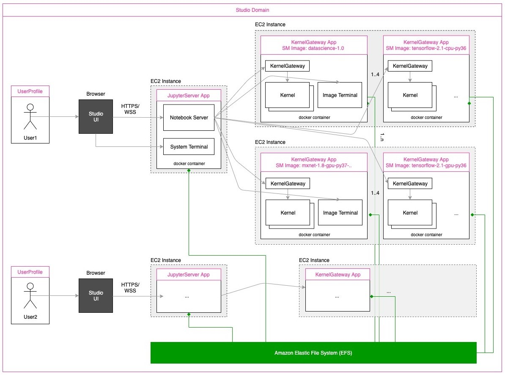

# SageMaker-Studio-Autoshutdown-Extension

This Jupyter extension automatically shuts down KernelGateway Apps, Kernels and Image Terminals in SageMaker Studio when they are idle for a stipulated period of time. You will be able to configure an idle time limit of your preference. 

Image below showcases the SageMaker Studio architecture. It is critical to understand how pricing works and which components will incur cost. Instance that hosts JupyterServer app and System Terminals is free. Customers will only pay for instances with at least one KernelGateway App that is "In Service" state. See [Dive deep into Amazon SageMaker Studio Notebooks architecture](https://aws.amazon.com/blogs/machine-learning/dive-deep-into-amazon-sagemaker-studio-notebook-architecture/) to learn more about Studio architecture.



## Requirements

* Please ensure your JupyterLab version is >= v1.2.18. You can check the version by opening a terminal window in SageMaker Studio (File > New -> Terminal) and running the following command: `jupyter lab --version`

## Installation Instructions

You can either install the extension manually, or automate the install through SageMaker Studio Lifecycle Configurations. Installation does not require Internet connection as all the dependencies are stored in the install tarball and can be done via Studio VPCOnly mode. 

### Install using Lifecycle configurations

You can create and attach a Lifecycle configuration script to the default JupyterServer app for your users. The LCC script is available [here](https://github.com/aws-samples/sagemaker-studio-lifecycle-config-examples/tree/main/scripts/install-autoshutdown-server-extension). For instructions to create and attach LCCs, and setting defaults, see [Use Lifecycle Configurations with Amazon SageMaker Studio](https://docs.aws.amazon.com/sagemaker/latest/dg/studio-lcc.html). For detailed setup instructions, see [Customize Amazon SageMaker Studio using Lifecycle Configurations](https://aws.amazon.com/blogs/machine-learning/customize-amazon-sagemaker-studio-using-lifecycle-configurations/). Once the LCC is set as a default at the domain level, all users inherit the extension by default. 

> :warning:
>- If you are switching Studio to JupyterLab3, and you have previously installed the plugin through LCC, you need to update the LCC to work with JupyterLab3. Pull the script from Github [here](https://github.com/aws-samples/sagemaker-studio-lifecycle-config-examples/tree/main/scripts/install-autoshutdown-server-extension) and recreate the LCC. 
>- If you have existing user profiles in your domain, they will have to restart their "default" JupyterServer app to inherit the LCC configuration.

### Install the extension manually

You can also install the extension from the JupyterServer terminal if you are administering the extension manually or would like to test. Here are the steps:

1. Open System Terminal (File -> New -> Terminal)

2. Download [this script](https://github.com/aws-samples/sagemaker-studio-lifecycle-config-examples/blob/main/scripts/install-autoshutdown-server-extension/on-jupyter-server-start.sh)

3. Change `TIMEOUT_IN_MINS` in the script as per your needs

4. Run the script. This will create a file called `set-time-interval.sh` in `.auto-shutdown` folder

5. Change Directory to `.auto-shutdown` and run `set-time-interval.sh`

6. To check if the extension was installed and confirm the time limit that was set, download and run [this](https://github.com/aws-samples/sagemaker-studio-auto-shutdown-extension/blob/main/check_idle_timeout_configuration.py) python script. The result should have the idle timeout, keep_terminals flag, and a count displaying the number of times the idle checker has run. If the extension has started running, the count should be greater than 1.

Kernel sessions update idle state to JupyterServer and will be deleted after the user set idle time limit is reached. Image Terminals do not report the idle state to JupyterServer. As such, we delete Image Terminals when there are no kernel sessions (open notebooks) on the instance and the idle timeout has elapsed. If you wish to keep the image terminals, you can set `keep_terminals` to True in the LCC script [here](https://github.com/aws-samples/sagemaker-studio-lifecycle-config-examples/blob/main/scripts/install-autoshutdown-server-extension/on-jupyter-server-start.sh#L33). Note that you will be charged for the KernelGateway app unless you manually shut down the image terminal and the corresponding KernelGateway app. 

### Monitoring the installation across all users

*If you have used Lifecycle configurations to set the extension as a default at the domain level, you do not need to monitor the installation across users.*

You can periodically monitor to check if the extension is installed and running across all users, and get notified if it is not. Checkout the folder [extension-checker](extension-checker) for more information. This feature is only supported in IAM mode, and is not supported in SSO mode.


## Idle Time Limit Setting

*Idle time limit (in minutes)* - This parameter is to set an idle time after which the idle kernels and Apps with no active notebook sessions will be terminated. By default the idle time limit is set to 120 mins. Idle state is decided based on JupyterServer’s implementation of execution_state and last_activity metadata of the kernels. Read this for more information - When is a kernel considered idle? (https://github.com/jupyter/notebook/issues/4634)

Note: 120 minutes is the recommended idle time. If the idle time is set to a low number (less than 10 minutes), the app may be shut down immediately after being created.

## Limitations

1. If you are not using a **default** LCC script as recommended, you will need to reinstall this extension and configure the idle time limit, each time you delete your user's JupyterServer app and recreate it. 

## Troubleshooting

1.  Ensure you're using the latest version of the extension (`sagemaker_studio_autoshutdown-0.1.5.tar.gz`). If you are on one of the older versions, update your LCC script and restart JupyterServer app.

2. Delete JupyterServer and recreate it. You can do this by selecting the User and going into User Details screen in SageMaker Studio console. It is a two step process: 1/ delete JupyterServer app. 2/ Click on "Open Studio", which will recreate JupterServer with the latest version.

3. Ensure you are testing for shutting down KernelGateway Apps, Kernels and Image Terminals. System Terminal will not be shutdown as it does not incur cost.

### Uninstall

```bash
pip uninstall sagemaker_studio_autoshutdown
```

## Security

See [CONTRIBUTING](CONTRIBUTING.md#security-issue-notifications) for more information.

## License

This project is licensed under the Apache-2.0 License.
