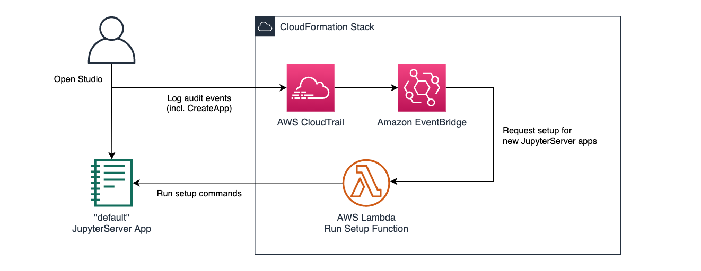

# Automatically customize SageMaker Studio JupyterLab on start-up

This example demonstrates a pattern you can use to automate installation of the auto-shutdown extension (or other customizations) for all users in your SageMaker Studio domain - provided the domain is configured for **IAM authentication (*not* SSO)**.


## Background

In SageMaker Studio, a user's notebook kernel sessions and their core JupyterLab-based UI both run as containerized "apps" - visible through the [AWS Console for SageMaker Studio](https://console.aws.amazon.com/sagemaker/home?#/studio). Each time a user restarts their "default" JupyterServer app (by selecting "Shut down" in the Studio UI, or deleting the app through the console), the SageMaker-provided container image will be refreshed. This means:

1. It's good practice to restart the default app regularly - to consume patches and newly released functionality - but,
2. Some manual customizations you make to the JupyterServer container (like installing the auto-shutdown extension) will be lost!

SageMaker Studio offers [custom kernel image functionality](https://docs.aws.amazon.com/sagemaker/latest/dg/studio-byoi-create.html) for managing persistent customizations to kernel environments, and automatically copying content to user home folders can be achieved with EFS integrations like [EFS for Lambda](https://aws.amazon.com/blogs/compute/using-amazon-efs-for-aws-lambda-in-your-serverless-applications/).

For Jupyter customizations like this extension, though, you may need a way to automatically execute commands as the JupyterServer starts up - similarly to the [lifecycle configuration script](https://docs.aws.amazon.com/sagemaker/latest/dg/notebook-lifecycle-config.html) tool on classic SageMaker Notebook Instances.


## How it works

In the absence of built-in functionality to run start-up scripts on Studio, this setup deploys a [CloudFormation](https://aws.amazon.com/cloudformation/) stack as shown below:



Using the publicly documented [JupyterServer REST API](https://jupyter-server.readthedocs.io/en/latest/developers/rest-api.html) and [Jupyter Client WebSocket API](https://jupyter-client.readthedocs.io/en/stable/messaging.html), a Lambda function can connect to SageMaker Studio as a web client would, and automatically run setup commands through the System Terminal.

The deployed stack detects [SageMaker CreateApp](https://docs.aws.amazon.com/sagemaker/latest/APIReference/API_CreateApp.html) events (raised whenever a JupyterServer app is started) via [AWS CloudTrail](https://aws.amazon.com/cloudtrail/), to trigger the function.

To log in to SageMaker Studio as the target user (to access the Jupyter APIs), the Lambda function requires the [SageMaker CreatePresignedDomainUrl](https://docs.aws.amazon.com/sagemaker/latest/APIReference/API_CreatePresignedDomainUrl.html) permission in IAM. This method does not work for Studio domains [onboarded](https://docs.aws.amazon.com/sagemaker/latest/dg/gs-studio-onboard.html) with SSO-based authentication.


## Setting up

You'll need:

- Sufficient access to your AWS account to deploy the stack, configured through the [AWS CLI](https://aws.amazon.com/cli/)
- An [Amazon S3 bucket](https://docs.aws.amazon.com/AmazonS3/latest/userguide/create-bucket-overview.html) in your target AWS Region, to stage the CloudFormation assets to for deployment
- Installed [AWS SAM CLI](https://docs.aws.amazon.com/serverless-application-model/latest/developerguide/serverless-sam-cli-install.html) and [Docker](https://www.docker.com/products/docker-desktop) (which we'll use to [build the Lambda bundle with library dependencies](https://docs.aws.amazon.com/lambda/latest/dg/python-package.html) as specified in `requirements.txt`)

Once you have those, you're ready to:

- Build the Lambda bundle:

```
sam build --use-container --template template.sam.yaml
```

- Stage the assets to an S3 bucket:

```
export DEPLOYMENT_BUCKET_NAME=YOUR_BUCKET_NAME
export DEPLOYMENT_BUCKET_PREFIX=IF_YOU_WANT_ONE

sam package --s3-bucket $DEPLOYMENT_BUCKET_NAME --s3-prefix $DEPLOYMENT_BUCKET_PREFIX --output-template-file template.tmp.yaml
```

- Deploy the compiled CloudFormation template using the assets:

```
sam deploy --template-file template.tmp.yaml --capabilities CAPABILITY_IAM --no-fail-on-empty-changeset --stack-name smstudio-setup
```

Assuming your stack deployed successfully, it's now actively monitoring the domain. Whenever a user starts their JupyterServer app, the Lambda will be invoked and run the commands to install the auto-shutdown extension.


## Security considerations

This stack is provided as an example only, with some design decisions prioritizing simplicity. You may need to adapt it for specific cloud security policies in your organization (such as deploying the Lambda function in a [VPC](https://aws.amazon.com/vpc/) or configuring KMS encryption on the CloudTrail storage).

In particular, note:

- This example deliberately **hard-codes the installation commands** in the Lambda. If you consider parameterizing the function to support arbitrary setup commands, ensure you have appropriate controls to ensure that only trusted entities can invoke the Lambda or modify the setup script.


## Caveats and limitations

While this is hopefully a useful example, it's worth noting that:

- The function is only triggered when the `CreateApp` call is logged - meaning that:
  - Commands will typically run **concurrently with the user** logging in... Unlike a lifecycle configuration script which would complete *before* the user gets access to Jupyter.
  - (Because the installation process was still running as they logged in), users will **need to refresh the page** to see the auto-shutdown extension in the sidebar.
  - The Lambda must **wait for the JupyterServer app to become ready**... So the amount of runtime available before the 15 minute Lambda timeout terminates execution is variable - unlike the static 5 minute limit on lifecycle configuration scripts.
- The function does not monitor for the **success or failure** of the installation commands:
  - Because commands are run via the terminal, the function just sees text as a human would through the terminal window.
  - You could consider extending the function and/or modifying the setup commands to explicitly log success or failure, and take follow-up actions.
  - The function could be adjusted to upload a shell script file via the [contents API](https://jupyter-server.readthedocs.io/en/latest/developers/rest-api.html#post--api-contents-path) and execute that as a single command, for a more consolidated flow.
- As written, the function **logs all terminal output from the commands to CloudWatch** - so particularly verbose scripts (like the install we demonstrate) may have high log volume.
